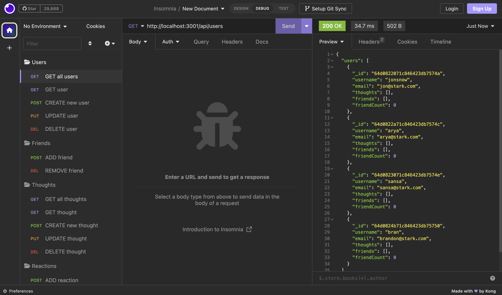

# congenial-train-18
The Module 18 Challenge demonstrates the use of MongoDB to build an API for a social network app

## Description
The Module 20 Challenge is a professional porfolio using all learned technologies so far, plus the latest and most popular in front-end technologies -- ReactJS. 

## Usage
To see how the social network's API database operates, click on the link below to watch a demonstration video:   
[Social DB: Video Demonstration](https://drive.google.com/file/d/1a_I76XvCuro4HJ9Q_hf-KrugBtYMb9Rm/view)  

The video demonstrates the functionality of the social app DB in which the user can add to, retrieve, update, and delete from the database. These functional features are as follows:
### User
- Create a new user
- Retrieve all users
- Retrieve one user by id
- Update a user
- Delete a user
- Add a friend to a user
- Remove a friend from a user
### Thought
- Create a new thought
- Retrieve all thoughts
- Retrieve one thought by id
- Update a thought
- Delete a thought
- Add a reaction to a thought
- Remove a reaction to a thought

## Credits
The following websites were used to generate this project:

[Professional README.md Guide](https://coding-boot-camp.github.io/full-stack/github/professional-readme-guide)

[GitLab DU Repo](https://git.bootcampcontent.com/University-of-Denver/DU-VIRT-FSF-PT-02-2023-U-LOLC)

## License
None.